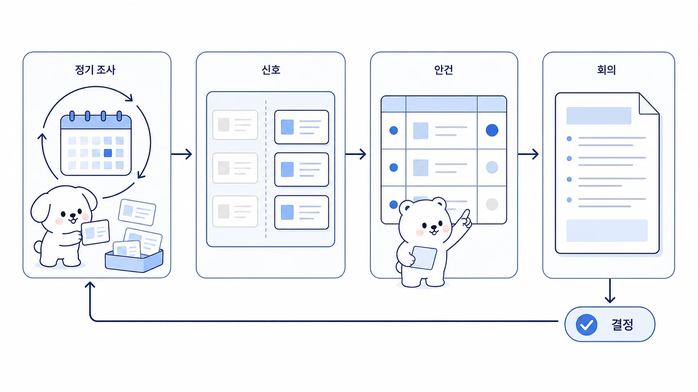

## 정기 리서치는 의사결정 회의자료로 어떻게 바꿀까

정기 리서치는 링크를 많이 모으는 일이 아니다. 매주 또는 매일 바뀐 신호를 보고, 무엇을 결정해야 하는지 회의자료로 바꾸는 일이다. Hermes Agent의 cron과 조사형 에이전트를 함께 쓰면 반복 수집은 자동화할 수 있지만, 최종 가치는 변화 감지와 판단 질문에 있다.



이 사례는 크론 조사, 방울이 확장조사, 하비의 중요도 판단, 뽀동이의 회의자료 정리를 하나의 흐름으로 묶는다.

[TOC]

## 시작 상황

AI 도구, 경쟁사, 고객 반응, 정책 변화, 시장 뉴스는 계속 바뀐다. 사람이 매번 처음부터 찾으면 시간이 오래 걸리고, 반대로 자동 수집만 하면 읽지 않는 링크 더미가 된다.

| 단계 | 나쁜 결과 | 좋은 결과 |
|---|---|---|
| 수집 | 링크 목록만 쌓임 | 변화가 있는 항목만 추림 |
| 조사 | 모든 뉴스를 같은 무게로 봄 | 결정에 영향을 주는 신호를 구분 |
| 정리 | 긴 요약 보고서 | 회의에서 바로 쓸 질문과 선택지 |
| 기록 | Slack에 흘러감 | 결정 메모와 다음 조사 기준으로 남음 |

## 맡긴 역할

| 역할 | 담당 |
|---|---|
| cron | 정해진 주기로 신호를 수집한다 |
| 방울이 | 중요한 변화의 근거와 반례를 확장조사한다 |
| 하비 | 넘길 것/더 팔 것/보류할 것을 판단한다 |
| 뽀동이 | 회의자료, 결정 메모, 다음 액션으로 정리한다 |
| 봉구 | 문서 저장, 링크 검증, 발행/공유를 실행한다 |

## 막힌 지점

정기 리서치가 실패하는 이유는 “새로운 정보”와 “결정에 필요한 정보”를 구분하지 않기 때문이다. 매일 새로운 뉴스가 있어도 우리 의사결정에 영향을 주지 않으면 회의자료로 올릴 필요가 없다.

## 운영 규칙

정기 리서치는 아래 순서로 운영한다.

1. 조사 주제와 결정 목적을 함께 적는다.
2. cron prompt는 단독으로 읽어도 실행 가능하게 쓴다.
3. 변화 없음도 결과로 보고하게 한다.
4. 방울이는 중요한 신호만 근거와 반례를 붙여 확장한다.
5. 하비는 `넘김/더 파기/보류/중복` 같은 판단 라벨을 붙인다.
6. 뽀동이는 회의 안건, 선택지, 결정 질문으로 정리한다.
7. 회의 후 결정 내용을 다음 리서치 기준에 반영한다.

## 따라 하는 방법

```text
하비야, 이번 주 AI 업무 자동화 리서치 결과를 의사결정 회의자료로 바꿔줘.

출력 형식:
1. 이번 주 중요한 변화 3개
2. 우리에게 영향이 있는 이유
3. 근거 링크와 반례
4. 회의에서 결정해야 할 질문
5. 선택지 A/B/C
6. 추천안과 리스크
7. 다음 주 cron 조사 기준 수정안

주의:
링크 목록이 아니라 결정 질문 중심으로 정리해줘.
```

## 좋은 예와 나쁜 예

| 구분 | 예시 |
|---|---|
| 나쁜 예 | “이번 주 AI 뉴스 정리해줘” |
| 좋은 예 | “우리 WikiDocs/강의/제품 전략에 영향을 주는 변화만 뽑고, 회의에서 결정할 질문과 선택지로 정리해줘” |

## 체크리스트

- 조사 목적과 의사결정 목적이 함께 적혔는가?
- 변화 없음도 보고 기준에 포함했는가?
- 근거와 반례가 같이 있는가?
- 회의에서 결정할 질문이 명확한가?
- 회의 후 다음 조사 기준이 갱신되는가?
- Slack 보고와 장기 문서 기록이 분리되어 있는가?

## 확장 아이디어

정기 리서치는 시장 조사, 경쟁사 모니터링, 정책 변화, 고객 피드백, 콘텐츠 기획 회의에 모두 쓸 수 있다. 핵심은 자동 수집을 회의자료로 바로 착각하지 않는 것이다. 수집은 시작이고, 판단 질문으로 바뀌어야 의사결정에 쓰인다.
