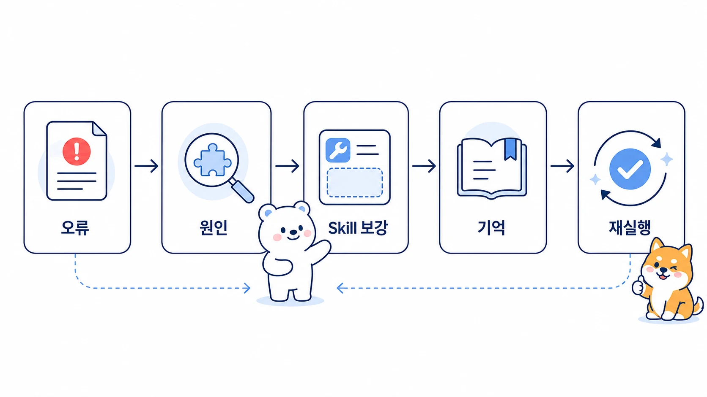

## 크론 오류를 Skill/메모리 개선으로 바꾸는 운영 케이스

AI 업무 자동화에서 좋은 사례는 성공한 자동화만이 아니다. 정해진 시간에 크론이 돌았는데 기대한 리포트 대신 오류 메시지가 도착했다면, 그 순간이 운영 시스템을 더 단단하게 만들 기회가 된다.



이 사례는 방울이의 매일 아침 제품 신호 크론이 실행된 뒤, 정상 리포트 대신 모델 API 차단 오류가 Slack에 배달된 상황에서 시작됐다. 중요한 점은 “크론이 실패했다”로 끝내지 않고, 실패가 어느 레이어에서 생겼는지 나누고, 다음 실행을 위해 Skill과 memory 경계를 다시 정리했다는 것이다.

[TOC]

## 상황

오전 9시 제품 신호 크론이 Slack thread에 결과를 보냈다. 그런데 결과는 리포트가 아니라 아래 유형의 오류였다.

```text
API call failed after retries.
The content was flagged for possible cybersecurity risk.
```

사용자 입장에서는 헷갈릴 수밖에 없다. 크론이 실행되지 않은 것인지, 방울이가 잘못 보낸 것인지, 모델 제공자 쪽에서 응답 생성을 막은 것인지 바로 보이지 않기 때문이다.

이때 운영자가 먼저 해야 할 일은 다시 실행 버튼을 누르는 것이 아니다. 실패를 세 층으로 나눠 확인해야 한다.

1. 스케줄러가 정해진 시간에 실행됐는가?
2. 실행 중 필요한 도구와 파일, 웹 접근은 정상적으로 동작했는가?
3. 마지막 응답 생성 단계에서 모델/API가 막힌 것은 아닌가?

## 막힌 지점

이 사례에서 Hermes cron 자체는 실행됐다. Slack에도 메시지가 도착했다. 그래서 겉으로 보면 scheduler 상태는 정상처럼 보일 수 있다.

하지만 결과물은 사용자가 기대한 제품 신호 리포트가 아니었다. 모델 API가 요청 내용을 안전 정책상 민감한 내용으로 오탐하면서 최종 리포트 생성이 멈췄고, 그 실패 메시지가 그대로 전달됐다.

즉 문제는 “예약 작업이 아예 돌지 않았다”가 아니라 “예약 작업은 돌았지만 최종 응답 생성 단계에서 막혔다”에 가까웠다.

## 핵심 원인

원인은 크론 prompt 하나만의 문제가 아니었다. 크론에 붙어 있던 보조 Skill과 조사 절차 일부가 모델 필터에 민감하게 읽힐 수 있는 표현을 포함하고 있었다.

예를 들어 공개 웹 조사를 하면서 막힌 페이지를 대신 확인하는 절차, 공개 API를 찾는 절차, 접근 실패 시 대체 경로를 찾는 표현이 제품 신호 모니터링 맥락과 섞이면 모델 제공자 입장에서는 보안 관련 작업처럼 보일 수 있다.

여기서 중요한 운영 판단은 두 가지다.

- 실제 작업 목적은 제품 신호 모니터링이었다.
- 하지만 크론 fresh session은 붙어 있는 Skill과 prompt 전체를 함께 읽기 때문에, 필요 이상으로 넓은 Skill이 오탐 가능성을 높일 수 있다.

## 운영 규칙

이 사건에서 남길 규칙은 “오류가 나면 다시 실행한다”가 아니다. 크론 오류를 레이어별로 나누고, 재발 가능성이 있는 절차는 Skill과 설정에 반영하는 것이다.

| 확인 레이어 | 봐야 할 것 | 조치 |
|---|---|---|
| schedule | 정해진 시간에 실행됐는가 | cron 목록과 최근 실행 시각 확인 |
| delivery | Slack/Telegram/로컬 출력으로 도착했는가 | delivery target과 gateway 상태 확인 |
| tool run | 웹/파일/브라우저 도구가 필요한 범위에서 실행됐는가 | toolset을 필요한 범위로 축소 |
| model response | 최종 응답 생성에서 정책/제공자 오류가 났는가 | prompt와 attached Skill 표현 점검 |
| reuse | 같은 유형이 반복될 수 있는가 | Skill, 체크리스트, memory 중 어디에 남길지 결정 |

## 따라 하는 방법

비슷한 오류가 생기면 아래 순서로 확인한다.

1. `cronjob list` 또는 Hermes cron 목록에서 해당 job의 schedule, next run, last status를 확인한다.
2. Slack에 도착한 메시지가 정상 결과물인지, 실패 메시지가 그대로 전달된 것인지 구분한다.
3. 해당 job에 붙은 Skill 목록을 확인한다.
4. 작업 목적에 비해 넓거나 민감하게 읽힐 수 있는 Skill을 제거하거나 더 좁은 Skill로 바꾼다.
5. toolset을 실제 필요한 범위로 줄인다.
6. 반복 가능한 절차는 Skill에 남기고, 사용자 선호나 고정 운영 원칙만 memory에 남긴다.
7. 다음 실행에서 같은 유형의 오류가 줄었는지 확인한다.

이때 memory에는 “오늘 어떤 job이 실패했다” 같은 일회성 로그를 남기지 않는다. 그런 기록은 session_search, cron 출력, GitHub log에서 찾으면 된다. memory에는 “제품 신호 크론은 과한 조사 Skill을 붙이지 않는다”처럼 다음에도 유효한 운영 기준만 남긴다.

## 좋은 예와 나쁜 예

| 구분 | 나쁜 예 | 좋은 예 |
|---|---|---|
| 원인 파악 | “크론이 실패했네”라고만 판단한다 | scheduler/tool/model/delivery 레이어를 나눠 본다 |
| 재실행 | 같은 prompt로 바로 다시 돌린다 | attached Skill과 toolset을 먼저 줄인다 |
| 기록 | Slack 오류 메시지를 그대로 복사해 둔다 | 다음에 확인할 체크리스트로 바꾼다 |
| Skill 관리 | 모든 조사 Skill을 계속 붙여 둔다 | 작업 목적에 필요한 Skill만 남긴다 |
| memory 관리 | 실패 로그를 장기 기억에 쌓는다 | 반복 운영 기준만 memory에 남긴다 |

## 체크리스트

- `last_status`가 정상이어도 결과물이 정상 리포트인지 확인했는가?
- 오류가 schedule, tool, model response, delivery 중 어느 레이어에서 생겼는가?
- cron fresh session에 필요한 맥락이 prompt 안에 충분히 들어 있는가?
- attached Skill이 작업 목적보다 넓지 않은가?
- toolset이 실제 필요한 범위보다 넓지 않은가?
- 재발 방지 기준을 Skill에 남길지, memory에 남길지 구분했는가?
- 외부에 공유할 때 내부 job id, 계정값, 원문 오류 전체를 그대로 노출하지 않았는가?

## FAQ

### 크론 상태가 정상인데 왜 실패라고 보나요?

스케줄러 입장에서는 job을 실행하고 메시지를 전달했기 때문에 정상으로 보일 수 있다. 하지만 사용자가 기대한 산출물이 아니라 API 실패 메시지가 도착했다면 업무 결과는 실패다. 그래서 cron 상태와 결과물 품질을 따로 봐야 한다.

### 이런 오류는 Skill을 고치면 모두 해결되나요?

항상 그렇지는 않다. 제공자 정책, 일시적 API 장애, 인증 문제, 네트워크 문제도 있을 수 있다. 다만 이 사례처럼 attached Skill이 너무 넓어 오탐 가능성을 키웠다면 Skill 구성과 표현을 줄이는 것이 첫 번째 개선책이다.

### memory에는 무엇을 남겨야 하나요?

일회성 실패 로그가 아니라 다음에도 유효한 기준만 남긴다. 예를 들어 “크론 오류는 schedule/tool/model/delivery 레이어로 나눠 본다”는 운영 기준이고, “어느 날 몇 시에 어떤 job이 실패했다”는 세션 기록이다.

## 다음에 읽을 글

크론 자체의 기본 구조는 [Hermes Agent cron과 Daily Briefing Bot](https://wikidocs.net/345926)에서 먼저 볼 수 있다. 실패를 절차로 바꾸는 방법은 [시행착오를 운영 체크리스트로 바꾸는 법](https://wikidocs.net/345916), 반복 절차를 보강하는 기준은 [Skill은 어떻게 보강하고 QA해야 할까](https://wikidocs.net/346238)와 함께 읽으면 좋다.
