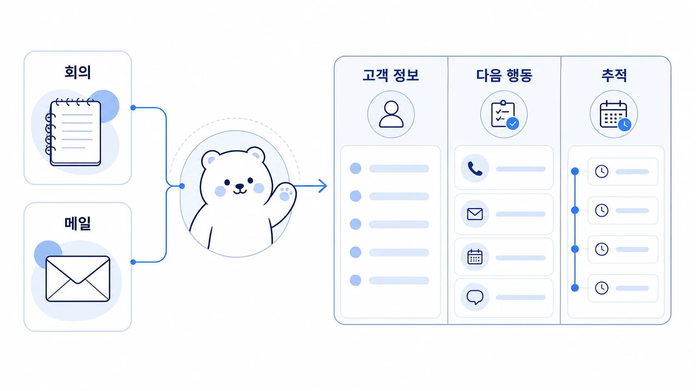

## 회의록과 메일은 어떻게 고객사 SDR 파이프라인으로 바꿀까

외부 미팅을 AI 개인비서에게 정리해 달라고 하면 보통 회의록 요약에서 끝난다. 하지만 실제 업무에서는 “무슨 이야기를 했는가”보다 “이 미팅이 다음 영업 행동으로 이어질 수 있는가”가 더 중요할 때가 많다. Hermes Agent로 외부 미팅을 다룰 때는 회의록, 후속 메일, 회사 인덱스, 다음 액션을 함께 묶어 고객사 SDR 파이프라인으로 바꾸는 흐름을 만들 수 있다.



이 사례의 핵심은 미팅 노트와 세일즈 파이프라인을 같은 문서에 섞어 쓰는 것이 아니다. 회의록은 사실 기록으로 남기고, 그 아래에 SDR 관점의 별도 레이어를 붙이는 것이다. 그러면 하비는 맥락을 통합하고, 뽀동이는 공유 가능한 구조로 정리하고, 봉구는 다음 팔로업을 실행 가능한 작업으로 넘길 수 있다.

[TOC]

## 시작 상황

외부 파트너사와 GEO 강의 기획 미팅을 진행했다고 가정해 보자. Slack에는 회의 전사 링크가 남아 있고, Gmail에는 후속 메일이 도착해 있다. 참석자, 제안안, 로이드의 선호, 다음 검토 방향이 각각 다른 곳에 흩어져 있다.

이때 단순 회의록만 만들면 아래 정도에서 끝난다.

| 원본 | 일반 회의록에 남는 것 |
|---|---|
| 회의 전사 | 논의 주제와 주요 발언 |
| 후속 메일 | 제안안과 회신 내용 |
| Slack 요청 | 정리 요청과 짧은 판단 |
| 회사 노트 | 미팅 날짜와 담당자 |

하지만 고객사 SDR 관점에서는 더 필요한 정보가 있다. 이 회사가 우리 ICP에 맞는지, 지금 기회 단계는 어디인지, 다음 팔로업은 무엇인지, 교육/컨설팅/데모 중 어떤 기회로 이어질 수 있는지까지 보여야 한다.

## 맡긴 역할

| 역할 | 담당 |
|---|---|
| 하비 | Slack 요청, 회의 전사, Gmail 후속 메일을 묶어 전체 맥락을 잡는다 |
| 방울이 | 필요하면 회사 정보, 시장 맥락, 기존 접점을 확장 조사한다 |
| 뽀동이 | 회의록과 SDR 레이어를 분리해 읽기 좋은 문서로 정리한다 |
| 봉구 | 승인된 다음 액션을 캘린더, 태스크, CRM 후보 항목으로 옮긴다 |

이 흐름에서 중요한 점은 하비가 모든 것을 하나의 요약으로 뭉개지 않는 것이다. 회의록, VOC, 세일즈 파이프라인은 서로 목적이 다르다. 같은 원본을 쓰더라도 결과 문서는 층을 나눠야 한다.

## 막힌 지점

외부 미팅 정리가 약해지는 이유는 회의록을 “기록 보관”으로만 보기 때문이다. 발언 요약은 깔끔해 보여도 시간이 지나면 다음 질문이 남는다.

- 이 회사는 지금 영업 기회인가, 단순 네트워킹인가?
- 담당자는 누구이고 다음 연락은 언제 해야 하는가?
- 상대가 실제로 원하는 것은 강의, 컨설팅, 데모, 콘텐츠 협업 중 무엇인가?
- 장애물은 예산, 일정, 내부 검토, 형식 불일치 중 무엇인가?
- 후속 메일에서 이미 정정되거나 확정된 내용은 무엇인가?

회의록이 이 질문에 답하지 못하면, 나중에 다시 전사와 메일을 뒤져야 한다. AI 업무 자동화의 가치는 여기서 생긴다. Hermes Agent는 흩어진 원본을 다시 읽고, “다음 행동이 보이는 기억”으로 바꿀 수 있다.

## 운영 규칙

외부 미팅을 SDR 파이프라인으로 바꿀 때는 아래 순서로 정리한다.

1. 회의 원본, 후속 메일, Slack 요청을 함께 확인한다.
2. 회의록 레이어와 SDR 레이어를 분리한다.
3. 회의록에는 사실, 결정, 미정, 다음 확인 질문을 남긴다.
4. SDR 레이어에는 단계, ICP 적합도, 니즈, 장애물, 기회 유형, 다음 트리거를 남긴다.
5. 후속 메일에서 정정된 내용은 회의록보다 우선 반영한다.
6. 담당자 세부 정보와 외부에 설명할 사례 구조를 분리한다.
7. 다음 액션은 사람 승인 후 캘린더, 태스크, CRM, 회사 인덱스로 넘긴다.

## SDR 레이어에 남길 필드

| 필드 | 질문 | 예시 |
|---|---|---|
| 파이프라인 단계 | 지금 관계는 어느 단계인가? | 신규 접점 / 제안 검토 / 조건 조율 / 보류 |
| ICP 적합도 | 우리에게 맞는 고객사인가? | 높음 / 중간 / 낮음 |
| 담당자 | 다음 연락 대상은 누구인가? | 담당자 이름, 역할, 연락 채널 |
| 핵심 니즈 | 상대가 실제로 원하는 것은 무엇인가? | GEO 강의, 내부 교육, 컨설팅, 데모 |
| 장애물 | 진행을 막는 요소는 무엇인가? | 일정, 예산, 형식, 내부 승인 |
| 기회 유형 | 어떤 사업 기회로 볼 수 있는가? | 오프라인 교육 / 기업 워크숍 / SaaS 데모 |
| 다음 팔로업 | 언제 무엇을 확인해야 하는가? | 커리큘럼 초안 전달, 일정 후보 회신 |
| 전환 가능성 | 다음 단계로 이어질 가능성은 어느 정도인가? | 높음 / 중간 / 낮음과 이유 |

이 필드는 CRM을 대체하기 위한 것이 아니다. 아직 CRM에 넣기 전이라도 AI 개인비서가 미팅 맥락을 잃지 않도록 만드는 중간 구조다.

## 따라 하는 방법

```text
하비야, 이 외부 미팅을 회의록뿐 아니라 고객사 SDR 파이프라인 관점으로도 정리해줘.

입력:
- Slack 요청 스레드
- 회의 전사 링크
- 관련 Gmail 후속 메일
- 기존 회사 노트나 미팅 노트가 있으면 함께 확인

출력 형식:
1. 회의 요약: 목적/참석자/핵심 논의
2. 결정 사항과 정정된 내용
3. 미정 사항과 다음 확인 질문
4. VOC: 상대가 반복해서 드러낸 니즈
5. SDR 레이어
   - 파이프라인 단계
   - ICP 적합도
   - 담당자/연락 채널
   - 니즈/장애물
   - 기회 유형
   - 다음 팔로업 트리거
6. 다음 액션: 담당자/기한/승인 필요 여부
7. 기록 위치: 회의 노트/회사 인덱스/CRM 후보

주의:
회의록과 세일즈 판단을 섞지 말고, 사실 기록과 영업 판단을 분리해줘.
후속 메일에서 정정된 내용은 반드시 반영해줘.
```

## 좋은 예와 나쁜 예

| 구분 | 나쁜 예 | 좋은 예 |
|---|---|---|
| 원본 확인 | 전사만 요약한다 | 전사, 후속 메일, Slack 요청, 회사 노트를 함께 본다 |
| 문서 구조 | 회의록 아래에 모든 판단을 섞는다 | 회의록 / VOC / SDR 레이어를 분리한다 |
| 다음 액션 | “추후 논의”라고 쓴다 | “커리큘럼 초안 전달 / 일정 후보 확인 / 담당자 회신 대기”로 쓴다 |
| 세일즈 판단 | 느낌으로 가능성을 적는다 | ICP, 니즈, 장애물, 다음 트리거 기준으로 적는다 |
| 기록 위치 | Slack에만 남긴다 | 회의 노트와 회사 인덱스, CRM 후보 위치를 나눈다 |

## 실제 운영에서 좋은 점

이 방식은 세일즈팀만을 위한 자동화가 아니다. 작은 팀이나 1인 대표에게 특히 유용하다. 외부 미팅은 대부분 Slack, 메일, 노트, 캘린더에 흩어지기 때문이다. 그 상태로 두면 다음 팔로업 타이밍을 놓치거나, 상대가 이미 정정한 내용을 다시 제안하는 일이 생긴다.

Hermes Agent를 메인 창구로 두면 요청은 짧아도 된다.

```text
하비야, 오늘 이 미팅 정리해줘. 관련 메일도 왔을 텐데 같이 보고, 미팅 노트뿐 아니라 SDR 파이프라인 관점도 붙여줘.
```

이 한 문장은 실제로 여러 작업으로 풀린다. 하비가 원본을 찾고, 뽀동이가 회의록과 SDR 구조를 정리하고, 봉구가 다음 실행으로 넘길 후보를 확인한다. 이렇게 되면 회의록은 저장된 기록이 아니라 다음 행동을 만드는 업무 자산이 된다.

## 체크리스트

- 회의 전사와 후속 메일을 함께 확인했는가?
- 후속 메일에서 정정된 내용이 회의록에 반영됐는가?
- 회의록, VOC, SDR 레이어가 분리되어 있는가?
- 파이프라인 단계와 ICP 적합도가 판단 근거와 함께 적혀 있는가?
- 다음 팔로업에 담당자, 기한, 승인 필요 여부가 있는가?
- 담당자 세부 정보와 외부에 설명할 사례 구조를 분리했는가?
- CRM이나 회사 인덱스로 옮길 후보 항목이 표시되어 있는가?

## FAQ

### 회의록과 CRM 기록은 하나로 합쳐도 되나요?

처음에는 합치지 않는 편이 좋다. 회의록은 사실 기록이고, CRM은 영업 판단과 다음 액션 중심이다. 같은 원본을 쓰더라도 두 레이어를 분리해야 나중에 사실과 해석이 섞이지 않는다.

### 모든 외부 미팅을 SDR 파이프라인으로 정리해야 하나요?

그럴 필요는 없다. 잠재 고객, 파트너, 교육/컨설팅 제안, 데모 요청처럼 다음 비즈니스 행동으로 이어질 가능성이 있는 미팅에만 적용하면 된다. 단순 네트워킹이나 정보 교환은 회의록과 관계 메모 정도로 충분하다.

### Gmail이나 CRM 쓰기 작업까지 자동화해도 되나요?

처음에는 읽기와 초안 생성까지만 맡기는 것이 안전하다. 메일 발송, 캘린더 등록, CRM 상태 변경은 사람 승인 후 실행하는 편이 좋다. 특히 외부 고객사 정보와 영업 단계는 잘못 기록되면 실제 관계에 영향을 줄 수 있다.

## 다음에 읽을 글

회의록 자체를 보고서나 발표자료로 바꾸는 기본 흐름은 [회의록은 보고서와 발표자료로 어떻게 바꿀까](https://wikidocs.net/346691)에서 먼저 볼 수 있다. Gmail과 Google Workspace 권한 경계는 [Google Workspace와 메일 MCP는 업무 흐름에 어떻게 붙일까](https://wikidocs.net/346693), 파일과 노트를 장기 기억으로 남기는 기준은 [파일과 노트는 AI 팀의 장기 기억으로 어떻게 남길까](https://wikidocs.net/346666)와 함께 읽으면 좋다.
