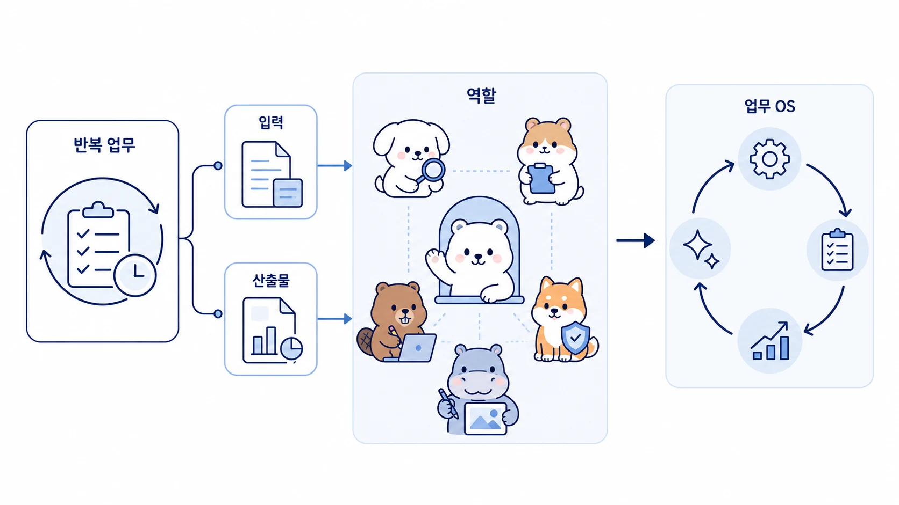

## 비개발자는 Hermes Agent로 어떻게 자기 업무 OS를 만들까

비개발자가 AI로 무언가를 만든다는 말은 꼭 앱을 배포한다는 뜻이 아니다. 흩어진 메모를 다시 꺼내 쓸 수 있는 기억으로 바꾸고, 반복 문서 작업을 Skill로 만들고, Slack 요청을 실행 가능한 업무 흐름으로 정리하고, 결과를 WikiDocs/GitHub에 남기는 것도 충분히 중요한 제작이다.



Hermes Agent를 쓰면 비개발자는 코딩 문법을 먼저 외우지 않아도 된다. 대신 자기 업무를 `입력 → 판단 → 역할 분리 → 실행 → 검증 → 기록`으로 나누고, 그 흐름을 AI 개인비서와 역할형 에이전트가 반복해서 도와주게 만들 수 있다. 이것이 이 책에서 말하는 개인 업무 OS다.

[TOC]

## 이 글의 답

비개발자가 Hermes Agent로 자기 업무 OS를 만든다는 것은 **내가 반복하는 일을 AI 팀이 이해하고 다시 실행할 수 있는 구조로 바꾸는 것**이다.

업무 OS에는 아래 요소가 필요하다.

- 메인 창구: 요청을 어디에 말할지
- 역할 분리: 조사/정리/실행/검증을 누가 맡을지
- 기억: 선호와 기준을 어디에 남길지
- 도구: 파일, 브라우저, GitHub, Slack, WikiDocs를 어떻게 연결할지
- 검증: AI가 만든 결과를 무엇으로 확인할지
- 재사용: 반복 절차를 Skill이나 체크리스트로 남길지

이 구조가 생기면 바이브코딩은 “AI에게 코드를 맡기는 기술”을 넘어, 내 업무를 소프트웨어처럼 다룰 수 있게 하는 운영 방식이 된다.

## 업무 OS는 앱이 아니라 흐름이다

많은 비개발자가 처음에는 “무언가 앱을 만들어야 한다”고 생각한다. 하지만 실제로 더 먼저 필요한 것은 앱이 아니라 흐름이다.

예를 들어 아래 업무를 보자.

| 하고 싶은 일 | 앱부터 만들 때 | 업무 OS로 볼 때 |
|---|---|---|
| 콘텐츠를 꾸준히 발행하고 싶다 | 블로그 자동 생성기를 만든다 | 조사/초안/이미지/발행/재가공 흐름을 만든다 |
| 고객 문의를 줄이고 싶다 | 챗봇을 붙인다 | 문의 유형/초안/승인/기록 기준을 만든다 |
| 자료조사를 빨리 하고 싶다 | 검색 자동화 도구를 만든다 | 질문/출처/비교표/결정 메모 흐름을 만든다 |
| 회의 후 실행이 안 된다 | 회의록 요약기를 만든다 | 결정/미정/담당/마감/후속 리마인드 흐름을 만든다 |
| 아이디어가 많지만 실행이 안 된다 | 할 일 앱을 만든다 | 요구사항/우선순위/실행/검증 흐름을 만든다 |

업무 OS는 화면보다 먼저 흐름을 다룬다. 흐름이 잡히면 나중에 대시보드, 자동화 스크립트, 앱, MCP, cron을 붙일 수 있다.

## 1단계: 반복 업무 하나를 고른다

첫 시작은 작아야 한다. “내 업무 전체를 자동화해줘”가 아니라 “매주 반복되는 이 업무 하나를 줄이고 싶다”로 시작한다.

좋은 첫 업무의 조건은 아래와 같다.

- 입력 자료가 분명하다.
- 결과물을 사람이 빠르게 검토할 수 있다.
- 실패해도 큰 손해가 없다.
- 다음에도 반복될 가능성이 높다.
- 성공 기준을 문장으로 설명할 수 있다.

예를 들어 이런 업무가 좋다.

- 매주 리서치 링크를 비교표로 바꾸기
- 회의록에서 결정/액션 아이템 뽑기
- 블로그 초안을 WikiDocs 구조로 정리하기
- 고객 문의 답장 초안 만들기
- 콘텐츠 아이디어를 4주 캘린더로 바꾸기

처음부터 결제, 계약, 고객 발송, 서버 배포처럼 실제 상태를 바꾸는 업무를 맡기지 않는다. 먼저 읽기/분류/초안/정리부터 시작한다.

## 2단계: 입력과 산출물을 분리한다

비개발자가 AI에게 일을 맡길 때 자주 빠지는 부분이 입력과 산출물이다. “잘 정리해줘”라고 말하면 AI는 그럴듯하게 정리할 수 있지만, 업무에 바로 쓰기 어려울 수 있다.

아래처럼 나눠 적으면 훨씬 안정적이다.

```text
업무명:

입력:
- 어디에 있는 자료인가?
- 어떤 기간/범위인가?
- 제외할 것은 무엇인가?

산출물:
- 표인가, 문서인가, 메시지 초안인가?
- 누가 읽는가?
- 어떤 결정을 돕는가?

검증:
- 사실 확인이 필요한 부분은 무엇인가?
- 사람이 승인해야 하는 지점은 어디인가?
```

이 구조가 있으면 하비가 요청을 해석하기 쉽고, 방울이/뽀동이/비벙이/봉구로 일을 나누기도 쉬워진다.

## 3단계: 역할형 에이전트로 나눈다

업무 OS의 핵심은 한 AI에게 모든 것을 맡기지 않는 것이다. 같은 모델을 쓰더라도 역할을 나누면 실패를 발견하기 쉬워진다.

예를 들어 “비개발자 바이브코딩 자료를 만들고 싶다”는 요청은 이렇게 나눌 수 있다.

```text
하비: 최종 목적과 독자 수준 판단
방울이: 시장 사례, 비개발자 pain point, 도구 비교 조사
뽀동이: 강의/문서/블로그 구조화
비벙이: 실습용 요구사항과 기능 범위 정리
봉구: 예제 프로젝트 실행/검증 순서 정리
하망이: 썸네일/본문 이미지 방향 정리
```

이렇게 나누면 “AI가 알아서 자료를 만들어줘”가 아니라, 실제 제작 흐름이 보인다.

## 4단계: 검증 지점을 먼저 정한다

비개발자에게 가장 위험한 자동화는 검증 없이 실행되는 자동화다. 좋은 업무 OS는 사람이 봐야 할 지점을 남긴다.

| 업무 | AI가 해도 좋은 것 | 사람이 봐야 하는 것 |
|---|---|---|
| 메일 | 중요도 분류/답장 초안 | 실제 발송/계약/가격/일정 확정 |
| 콘텐츠 | 초안/제목/구조/FAQ | 공개 전 사실 확인/브랜드 톤/법적 표현 |
| 리서치 | 출처 수집/비교표 | 최종 선택/예산/리스크 판단 |
| 고객응대 | 문의 유형 분류/초안 | 민감 고객/환불/개인정보/분쟁 |
| 코드/자동화 | 작은 기능 구현/테스트 제안 | 권한 있는 배포/데이터 삭제/결제 연동 |

검증 지점이 없으면 자동화는 빨라지는 대신 불안해진다. Hermes Agent에서는 완료 보고에 “무엇을 확인했고 무엇이 남았는지”를 넣어 이 불안을 줄인다.

## 5단계: 한 번 성공한 흐름을 Skill로 남긴다

업무 OS가 되려면 매번 처음부터 설명하지 않아야 한다. 한 번 성공한 흐름은 아래 중 하나로 남긴다.

| 남길 것 | 위치 | 예시 |
|---|---|---|
| 사용자 선호 | memory/user profile | 짧은 완료 보고를 선호한다 |
| 팀 공통 기준 | shared-memory | 공개 콘텐츠에서 보호할 정보 기준 |
| 반복 절차 | Skill | WikiDocs 발행 검증 절차 |
| 긴 자료/원본 | Obsidian/GitHub/WikiDocs | 강의안, 조사 원본, 출처 모음 |
| 과거 작업 맥락 | session search | 이전에 했던 Slack 요청과 완료 결과 |

중요한 것은 아무거나 memory에 넣지 않는 것이다. 반복 절차는 Skill, 공개 지식은 WikiDocs, 긴 원문은 Obsidian/GitHub처럼 위치를 나눠야 한다.

## 예시: 콘텐츠 OS 만들기

비개발자가 가장 쉽게 시작할 수 있는 업무 OS 중 하나는 콘텐츠 OS다.

```text
1. 주제 후보를 Slack에 던진다.
2. 하비가 목적/독자/채널을 정리한다.
3. 방울이가 사례와 검색 의도를 조사한다.
4. 뽀동이가 WikiDocs/블로그/뉴스레터 구조로 바꾼다.
5. 하망이가 썸네일이나 본문 이미지 방향을 잡는다.
6. 봉구가 링크, 이미지, 공개 범위, GitHub 상태를 검증한다.
7. 발행 후 반복되는 기준은 Skill/체크리스트로 남긴다.
```

이 흐름은 단순 글쓰기 자동화가 아니다. 주제 발굴, 조사, 작성, 이미지, 발행, 재사용이 이어지는 콘텐츠 운영 시스템이다.

## 예시: 고객 문의 OS 만들기

고객 문의도 처음부터 챗봇으로 자동 응대하지 않는다.

```text
1. 최근 문의를 모은다.
2. 문의 유형을 5개 이하로 나눈다.
3. 각 유형별 답장 초안을 만든다.
4. 자동 발송 금지 항목을 정한다.
5. 사람 승인 후 보낼 답변만 분리한다.
6. 반복되는 기준을 Skill로 남긴다.
7. 월 1회 FAQ/WikiDocs/내부 문서로 업데이트한다.
```

이렇게 하면 비개발자도 고객응대 자동화를 안전하게 시작할 수 있다.

## 30분 실습

아래 실습은 도구 설치 없이도 시작할 수 있다.

### 0~5분: 업무 하나 고르기

```text
내가 이번 주에 줄이고 싶은 반복 업무:

이 업무가 반복되는 빈도:

실패해도 위험이 작은 이유:
```

### 5~10분: 입력과 산출물 적기

```text
입력 자료:

최종 산출물:

읽는 사람:

사람이 확인해야 하는 부분:
```

### 10~20분: 역할 나누기

```text
하비가 판단할 것:
방울이가 조사할 것:
뽀동이가 정리할 것:
비벙이가 요구사항으로 바꿀 것:
봉구가 실행/검증할 것:
```

### 20~30분: 첫 요청문 만들기

```text
하비야, 아래 반복 업무를 바로 자동화하지 말고 업무 OS 형태로 정리해줘.

업무:
[업무 설명]

입력:
[자료 위치와 범위]

원하는 산출물:
[문서/표/초안/체크리스트]

주의:
- 실제 발송/삭제/배포는 하지 마.
- 사람이 승인해야 할 지점을 표시해줘.
- 반복되면 Skill로 남길 수 있는 절차를 따로 정리해줘.
```

이 요청문 하나만 있어도 비개발자는 “AI에게 뭘 시켜야 하지?”에서 벗어나 첫 운영 흐름을 만들 수 있다.

## 체크리스트

업무 OS가 되었는지 확인하려면 아래 질문을 본다.

- 요청을 받을 메인 창구가 정해졌는가?
- 입력 자료와 산출물이 분리되어 있는가?
- 조사/정리/실행/검증 역할이 나뉘었는가?
- 사람이 승인해야 할 지점이 보이는가?
- 결과가 Slack 대화 안에서만 끝나지 않는가?
- 다음에도 반복할 절차가 Skill이나 체크리스트 후보로 남았는가?
- 외부에 공유할 때 제거해야 할 내부 정보가 표시되어 있는가?

## FAQ

### 업무 OS와 바이브코딩은 다른 건가요?

겹치지만 초점이 다르다. 바이브코딩은 AI와 함께 무언가를 만드는 감각에 가깝고, 업무 OS는 그 결과가 계속 굴러가도록 요청/기억/검증/기록을 묶는 운영 구조에 가깝다.

### 앱을 만들지 않아도 업무 OS라고 부를 수 있나요?

그렇다. 앱은 업무 OS의 한 형태일 뿐이다. 반복 문서, 자동화 템플릿, Skill, WikiDocs, Slack 승인 흐름도 충분히 업무 OS의 일부다.

### 비개발자가 처음부터 Hermes Agent를 써도 되나요?

가능하다. 다만 처음에는 모든 기능을 켜지 말고 Slack/CLI 요청, 파일 읽기, 문서 정리, 발행 검증처럼 작은 흐름부터 시작하는 것이 좋다.

## 다음에 읽을 글

- [10-2. 비개발자 AI 도입은 왜 혼자 하다 멈출까](https://wikidocs.net/346954)
- [A-6. 비개발자를 위한 AI 업무 자동화 워크시트](https://wikidocs.net/346956)
- [06-1. Hermes Agent Skill은 무엇이고 언제 만들까](https://wikidocs.net/345904)
