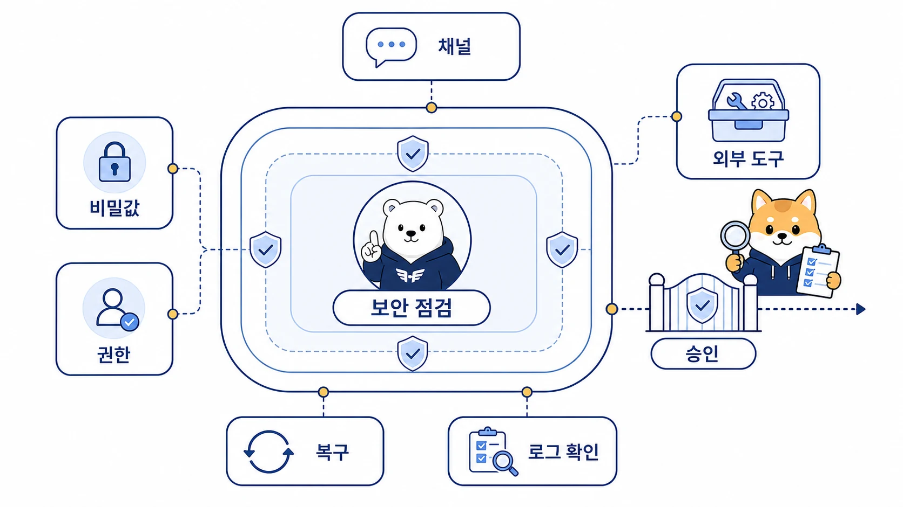

## 부록 A-2. Hermes Agent 보안 체크리스트

Hermes Agent 보안은 마지막에 붙이는 옵션이 아니다. AI 개인비서가 도구를 실행하고, 외부 채널에서 요청을 받고, GitHub/WikiDocs/Slack/Google Workspace 같은 업무 시스템에 연결될수록 권한과 기록 기준을 먼저 정해야 한다.

완벽한 보안 정책보다 먼저 필요한 것은 운영 전 최소 점검표다. 명령어와 설정 키는 [Hermes Agent 공식 문서](https://hermes-agent.nousresearch.com/docs/)에서 다시 확인한다.

[TOC]

## 1. 비밀값과 인증 정보

| 확인할 것 | 기준 |
|---|---|
| API key/token/password | README, WikiDocs, Slack 보고, 예제 코드에 실제 값을 쓰지 않는다. |
| `.env`와 `auth.json` | API key는 `.env`, OAuth/credential pool 정보는 `auth.json` 흐름으로 구분한다. |
| OAuth scope | 필요한 권한만 요청하고 쓰지 않는 scope는 제거한다. |
| 로그 공유 | token, webhook URL, channel ID, 계정 정보가 섞였는지 먼저 본다. |
| Skill의 secret 요구 | 메시징 채널에 비밀값을 쓰지 않고 로컬 CLI나 `.env`에서 설정한다. |

## 2. 도구 실행 권한

| 확인할 것 | 기준 |
|---|---|
| terminal/file/git 권한 | 상태 변경 도구는 실행형 에이전트나 승인된 profile에만 맡긴다. |
| 위험 명령 | 삭제, 배포, 권한 변경, 대량 수정은 바로 실행하지 않는다. |
| YOLO mode | 승인 우회는 격리된 테스트 범위에서만 쓴다. |
| toolset 범위 | 조사만 필요한 작업에는 파일 수정/터미널 도구를 열지 않는다. |
| 실행 결과 검증 | “성공했다고 말했다”가 아니라 status, URL, 파일, 공개 페이지를 확인한다. |

## 3. 채널과 Gateway

| 확인할 것 | 기준 |
|---|---|
| Messaging Gateway 범위 | Slack/Telegram/Discord/Webhook별 요청 허용 범위를 나눈다. |
| allowlist/pairing | 허용되지 않은 사용자가 요청하지 못하게 한다. |
| 멀티봇 호출 규칙 | 직접 호출되지 않은 봇은 침묵하는 기준을 둔다. |
| 공개/내부 채널 | 내부 값이 공개 채널로 나가지 않게 보고 포맷을 나눈다. |
| cron delivery | fresh session prompt와 전달 대상을 명확히 쓴다. |

## 4. Nous Tool Gateway와 외부 도구 키

| 확인할 것 | 기준 |
|---|---|
| Gateway 구분 | Messaging Gateway는 채널 입구, Nous Tool Gateway는 도구 호출 경로다. |
| `use_gateway` | web/image_gen/tts/browser 도구별로 gateway 사용 여부를 확인한다. |
| direct API key | `use_gateway: true`를 쓰더라도 직접 key 보관 정책을 따로 정한다. |
| 대체 경로 | 구독 만료나 장애 시 direct API key 또는 다른 provider로 전환할 수 있어야 한다. |

## 5. profile, workspace, sandbox

| 확인할 것 | 기준 |
|---|---|
| profile의 역할 | config, `.env`, SOUL.md, memory, sessions, skills, cron, gateway state를 분리한다. |
| profile의 한계 | 파일 접근 자체나 OS 사용자 권한을 막는 샌드박스는 아니다. |
| 작업 시작 위치 | 필요한 경우 `terminal.cwd`를 절대 경로로 지정한다. |
| 위험 작업 격리 | local backend가 위험하면 Docker/SSH/Modal 같은 실행 환경을 검토한다. |
| SOUL.md | 행동 지침이지 접근 제어 장치가 아니다. |

## 6. 발행과 복구

| 확인할 것 | 기준 |
|---|---|
| GitHub/WikiDocs 일치 | GitHub push 후 WikiDocs 공개 반영을 확인한다. |
| 공개 사례 | 내부 경로, 토큰, 계정, 개인 대화는 판단 기준으로 추상화한다. |
| 이미지/첨부 | 스크린샷, 썸네일, 로그 이미지도 업로드 전 확인한다. |
| diff와 rollback | 파일 수정, 페이지 생성, 대량 치환 전후 차이를 보고 되돌릴 기준을 둔다. |
| 반복 사고 | 한 번 겪은 문제는 체크리스트나 Skill에 반영한다. |

## 운영 전 다섯 문장

바로 운영에 붙이기 전에는 아래 질문에 답할 수 있어야 한다.

1. 이 작업이 접근할 수 있는 도구와 데이터는 어디까지인가?
2. 실패하면 무엇을 기준으로 되돌릴 수 있는가?
3. 결과가 문서나 외부 채널로 나가기 전에 무엇을 가릴 것인가?
4. Messaging Gateway, Nous Tool Gateway, MCP, cron 중 어느 경로가 실제로 실행되는가?
5. 다음에도 같은 실수를 줄이기 위해 어디에 기준을 남길 것인가?
