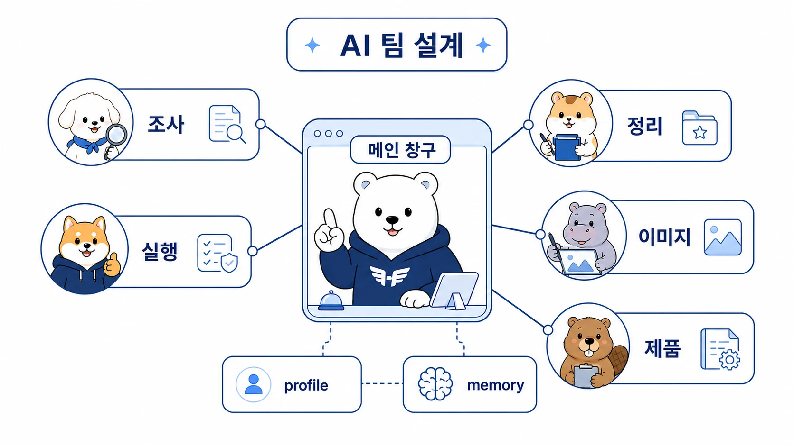

## 부록 A-3. 나만의 AI 팀 설계 워크시트

이 워크시트는 Hermes Agent를 처음 세팅하거나 기존 AI 사용 방식을 정리할 때 쓰는 실전 점검표다. 목표는 에이전트 이름을 많이 만드는 것이 아니라 요청을 누가 받고, 어떤 역할로 나누고, 무엇을 기억하고, 어떤 도구와 연결할지 정하는 것이다.

처음에는 빈칸을 짧게 채우면 된다. 실제 운영하면서 memory, Skill, toolset, cron, Messaging Gateway, MCP 기준을 조금씩 안정화한다.



[TOC]

## 1. AI 팀의 목적

```text
반복하고 싶은 업무:

지금 자주 막히는 이유:

AI가 맡으면 좋은 부분:

사람이 계속 판단해야 하는 부분:
```

## 2. 메인 창구

| 질문 | 내 답 |
|---|---|
| 요청을 먼저 받을 AI 개인비서는 누구인가 |  |
| 이 메인 창구가 직접 처리해도 되는 일은 무엇인가 |  |
| 다른 역할형 에이전트에 넘겨야 하는 신호는 무엇인가 |  |
| 최종 결과를 어디로 보고해야 하는가 |  |
| 새 세션에서도 유지되어야 하는 기준은 무엇인가 |  |

## 3. 역할 나누기

| 역할 | 맡길 일 | 맡기면 안 되는 일 | 검증 기준 | 필요한 toolset |
|---|---|---|---|---|
| 조사형 에이전트 |  |  |  | web/browser/session_search |
| 정리형 에이전트 |  |  |  | file/search/skills |
| 실행형 에이전트 |  |  |  | terminal/file/git 관련 도구 |
| 이미지 제작형 에이전트 |  |  |  | image_gen/vision/file |
| 제품/기능 정리형 에이전트 |  |  |  | file/search/session_search |

역할은 “누가 더 똑똑한가”가 아니라 “어떤 실패 방식이 다른가”로 나눈다. 조사형은 근거가 약해질 수 있고, 정리형은 그럴듯하지만 약한 글을 만들 수 있으며, 실행형은 작은 실수가 실제 상태 변경으로 이어질 수 있다.

## 4. profile과 실행 경계

| 질문 | 내 답 |
|---|---|
| 별도 profile이 필요한 역할인가 |  |
| profile로 분리할 것 | config / `.env` / SOUL.md / memories / sessions / skills / cron / gateway state |
| profile이 분리하지 못하는 것 | filesystem 접근 자체 / local backend 권한 / OS 사용자 권한 |
| 작업 시작 위치 |  |
| 필요하면 `terminal.cwd`를 어떤 절대 경로로 둘 것인가 |  |

profile은 여러 에이전트의 정체성과 상태를 나누는 데 강하다. 하지만 공식 문서 기준으로 profile은 샌드박스가 아니다.

## 5. 기억 설계

| 남길 정보 | 둘 곳 | 이유 |
|---|---|---|
| 사용자 선호와 말투 | `USER.md` / user profile |  |
| 환경 사실과 운영 교훈 | `MEMORY.md` |  |
| 팀 공통 규칙 | shared-memory 또는 별도 팀 문서 |  |
| 프로젝트별 기준 | `.hermes.md` / `HERMES.md` / `AGENTS.md` / `CLAUDE.md` / `.cursorrules` |  |
| 에이전트 정체성과 톤 | `SOUL.md` |  |
| 과거 작업 결과 | session search / GitHub / WikiDocs |  |
| 긴 원문과 참고 자료 | Obsidian / RAG / GitHub / 외부 memory provider |  |
| 남기면 안 되는 값 | `.env` / secret store / 내부 보안 문서 |  |

## 6. Skill 후보 찾기

| 반복 업무 | Skill 후보인가 | 아직 만들면 안 되는 이유 | 검증 순서 |
|---|---|---|---|
|  |  |  |  |
|  |  |  |  |
|  |  |  |  |

Skill은 한 번 한 일을 무조건 저장하는 곳이 아니다. 같은 절차가 반복되고, 검증 기준이 분명하며, 다음에도 재사용할 가능성이 있을 때 만든다.

## 7. 도구와 채널 연결

| 연결 대상 | 연결 방식 | 먼저 확인할 것 |
|---|---|---|
| Slack/Telegram/Discord/Email/Webhook | Messaging Gateway | 호출 규칙, allowlist/pairing, 전달 채널, 멀티봇 침묵 기준 |
| web/image/TTS/browser 도구 | Nous Tool Gateway 또는 직접 API key | `use_gateway` 여부, 구독 상태, direct key 대체 경로 |
| GitHub | CLI/API/MCP | 인증, branch, diff, commit/push 기준 |
| WikiDocs | GitHub 연동/MCP | TOC, 이미지, 공개 반영 확인 |
| Google Workspace/Notion/DB | MCP/API | OAuth scope, 비용, 권한, HTTP/stdio 서버 방식 |
| 정기 작업 | cron | fresh session prompt, delivery target, workdir, 실패 보고 |

## 8. 첫 운영 시나리오

```text
사용자 요청:

메인 창구가 먼저 판단할 것:

조사형 에이전트가 확인할 것:

정리형 에이전트가 만들 것:

실행형 에이전트가 실행/검증할 것:

이미지 제작형 에이전트가 도울 수 있는 부분:

최종 결과물:

검증 기준:

다음에 남길 memory/Skill/체크리스트:
```

## 9. 운영 후 회고

1. 요청이 어디서 시작됐는가?
2. 역할 분리가 과했거나 부족하지 않았는가?
3. 결과물이 실제로 검증됐는가?
4. 다음에도 반복할 수 있는 절차가 생겼는가?
5. memory에 남길 것과 Skill로 남길 것이 구분됐는가?
6. 공식 문서 기준의 기능명/명령어/설정값과 어긋난 표현은 없었는가?
7. 공개 문서로 옮길 때 보호해야 할 정보가 제거됐는가?

이 질문에 답할 수 있으면 AI 팀은 이름 목록이 아니라 반복 가능한 업무 운영 구조가 된다.
