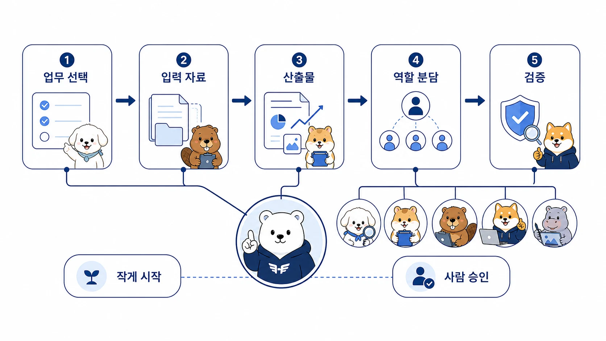

## 부록 A-6. 비개발자를 위한 AI 업무 자동화 워크시트

이 워크시트는 코딩을 먼저 배우기보다 내 업무를 AI 에이전트가 처리할 수 있는 흐름으로 정리하고 싶은 사람을 위한 도구다. 목표는 앱을 바로 만드는 것이 아니라 반복 업무 하나를 `입력 → 역할 → 검증 → 기록 → 재사용` 구조로 바꾸는 것이다.

처음에는 빈칸을 짧게 채워도 된다. 중요한 것은 “AI가 알아서 해줘”가 아니라 “어디까지 맡기고 어디서 사람이 확인할지”를 보이게 만드는 것이다.



[TOC]

## 1. 줄이고 싶은 업무 고르기

```text
업무 이름:

이 업무를 하는 빈도:

지금 가장 귀찮거나 시간이 걸리는 부분:

AI가 도와주면 좋은 부분:

AI에게 바로 맡기면 위험한 부분:
```

### 좋은 첫 업무 조건

| 질문 | 내 답 |
|---|---|
| 입력 자료가 분명한가 |  |
| 결과물을 사람이 빠르게 확인할 수 있는가 |  |
| 실패해도 큰 손해가 없는가 |  |
| 다음에도 반복될 가능성이 있는가 |  |
| 성공 기준을 한 문장으로 말할 수 있는가 |  |

## 2. 입력 자료 정리

```text
입력 자료 위치:
- Slack:
- 메일:
- Google Drive/Docs/Sheets:
- Notion/Obsidian:
- GitHub/WikiDocs:
- 로컬 파일:
- 기타:

포함할 범위:

제외할 범위:

민감 정보/공개하면 안 되는 정보:
```

## 3. 원하는 산출물 정의

| 질문 | 내 답 |
|---|---|
| 최종 산출물은 무엇인가 | 문서 / 표 / 메시지 초안 / 체크리스트 / 대시보드 기획 / 코드 / 이미지 브리프 |
| 누가 읽거나 사용할 것인가 |  |
| 이 산출물이 도와야 하는 결정은 무엇인가 |  |
| 길이와 형식 제한이 있는가 |  |
| 외부에 공유해도 되는 수준인가 |  |

### 산출물 예시

```text
좋은 요청:
회의록을 요약해줘.

더 좋은 요청:
회의록에서 결정된 것, 아직 미정인 것, 담당자별 액션 아이템, 다음 회의 전에 확인할 질문을 표로 정리해줘. 외부에 공유하기 어려운 실명과 금액은 일반화해줘.
```

## 4. 역할형 에이전트로 나누기

| 역할 | 맡길 일 | 맡기면 안 되는 일 | 검증 기준 |
|---|---|---|---|
| 하비 / 메인 창구 | 목표/범위/우선순위 판단 | 근거 없이 최종 확정 | 최종 산출물과 다음 액션이 보이는가 |
| 방울이 / 조사형 | 출처/사례/반례 수집 | 출처 없는 단정 | 링크와 근거가 구분되는가 |
| 뽀동이 / 정리형 | 문서 구조/제목/CTA/FAQ | 근거 없는 꾸며쓰기 | 독자가 바로 쓸 수 있는가 |
| 비벙이 / 제품 정리형 | 기능 요구사항/데이터 구조/사용자 흐름 | 범위 없는 기능 추가 | 무엇을 만들지 검증 가능한가 |
| 봉구 / 실행형 | 파일 수정/배포/검증/복구 | 승인 없는 위험 명령 | 실행 결과를 확인했는가 |
| 하망이 / 이미지 제작형 | 이미지 방향/브리프/검수 | 본문과 동떨어진 이미지 | 메시지와 화면 목적이 맞는가 |

## 5. 사람 승인 지점 정하기

아래 항목 중 하나라도 포함되면 자동 실행보다 초안/검토 흐름으로 시작한다.

| 위험 항목 | 승인 기준 |
|---|---|
| 메일/메시지 실제 발송 | 사람이 최종 문구와 수신자를 확인 |
| 고객 정보/개인정보 | 익명화 또는 내부 문서로 제한 |
| 가격/계약/환불/법무 | 담당자 승인 전 발송 금지 |
| 파일 삭제/DB 수정/배포 | 백업/diff/rollback 확인 후 실행 |
| 공개 콘텐츠 발행 | 사실 확인/링크/이미지/브랜드 톤 검수 |
| 외부 도구 권한 연결 | scope/계정/실행 범위 확인 |

## 6. 첫 요청문 만들기

아래 템플릿을 그대로 복사해 시작한다.

```text
하비야, 아래 업무를 바로 실행하지 말고 먼저 AI 업무 자동화 흐름으로 정리해줘.

업무:
[줄이고 싶은 반복 업무]

입력 자료:
[자료 위치 / 기간 / 포함 범위 / 제외 범위]

원하는 산출물:
[문서 / 표 / 초안 / 체크리스트 / 대시보드 기획 / 코드]

역할 분리:
- 하비가 먼저 판단할 것:
- 방울이가 조사할 것:
- 뽀동이가 정리할 것:
- 비벙이가 요구사항으로 바꿀 것:
- 봉구가 실행/검증할 것:
- 하망이가 이미지 방향을 도울 수 있는 부분:

주의:
- 실제 발송/삭제/배포/결제/계약 변경은 하지 마.
- 사람이 승인해야 하는 지점을 표시해줘.
- 반복되면 Skill로 남길 수 있는 절차를 따로 정리해줘.
- 외부에 공유하기 어려운 정보는 제거하거나 일반화해줘.

완료 보고 형식:
- 정리된 업무 흐름:
- 역할별 할 일:
- 사람 승인 지점:
- 첫 실행에 필요한 자료:
- 다음에 Skill/memory/WikiDocs로 남길 것:
```

## 7. 결과물 검수표

AI가 결과를 만들면 아래 표로 확인한다.

| 확인 항목 | 통과 기준 | 결과 |
|---|---|---|
| 목적 | 어떤 문제를 줄이는지 한 문장으로 보인다 |  |
| 입력 | 자료 위치와 범위가 분명하다 |  |
| 역할 | 조사/정리/실행/검증이 섞이지 않았다 |  |
| 승인 | 사람이 봐야 할 지점이 표시되어 있다 |  |
| 검증 | 사실/링크/파일/실행 결과 확인 방법이 있다 |  |
| 기록 | 결과가 어디에 남을지 정해져 있다 |  |
| 재사용 | Skill/체크리스트 후보가 보인다 |  |
| 보호 정보 | 공개하면 안 되는 정보가 제거되어 있다 |  |

## 8. 한 번 성공한 뒤 남길 것

| 발견한 것 | 남길 위치 | 예시 |
|---|---|---|
| 개인 선호 | user profile/memory | 완료 보고는 3줄을 선호한다 |
| 환경 사실 | memory | 특정 repo의 remote/auth 기준 |
| 반복 절차 | Skill | WikiDocs 발행 전 검증 순서 |
| 팀 공통 규칙 | shared-memory | Slack 멀티봇 호출 규칙 |
| 긴 원문/참고 자료 | Obsidian/GitHub/WikiDocs | 강의안, 조사 원본, 출처 모음 |
| 공유할 수 있는 노하우 | WikiDocs/블로그 | 비개발자 자동화 사례 |

### memory에 바로 넣지 말아야 할 것

- 일회성 작업 진행 상황
- 긴 원문 전체
- 토큰/비밀번호/개인정보
- 아직 검증되지 않은 추측
- 절차가 필요한 긴 명령 목록

절차는 Skill, 긴 자료는 Obsidian/GitHub/WikiDocs, 과거 대화 맥락은 session search로 두는 편이 안전하다.

## 9. 30분 실습 기록지

```text
오늘 고른 업무:

입력 자료:

원하는 산출물:

첫 요청문:

AI가 만든 결과 중 쓸만한 것:

사람이 고쳐야 했던 것:

다음에 반복할 기준:

Skill 후보:

공유용 문서나 블로그로 바꿀 수 있는 부분:
```

## 10. 다음 액션

워크시트를 채웠다면 바로 전체 자동화를 만들지 말고, 아래 순서로 진행한다.

1. 읽기/정리/초안 생성까지만 첫 실행을 한다.
2. 사람이 검수한다.
3. 한 번 더 같은 기준으로 반복해본다.
4. 두 번 이상 반복되면 Skill 후보로 정리한다.
5. 공유할 수 있는 운영 지식은 WikiDocs나 블로그에 맞게 일반화한다.

이 순서가 지켜지면 비개발자도 코딩 문법보다 먼저 자기 업무를 AI가 다룰 수 있는 구조로 바꿀 수 있다.
